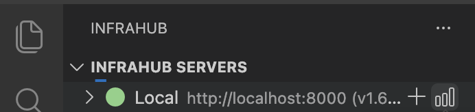
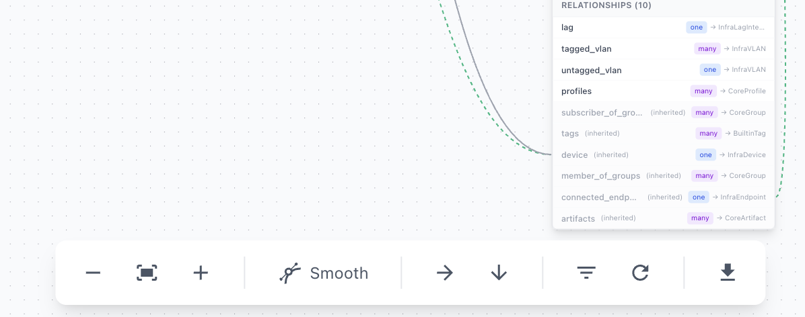

If you want to explore and understand the structure of your Infrahub schema, this guide shows you how to use the Schema Visualizer to view nodes, relationships, and attributes in an interactive graph.

## Prerequisites

- Infrahub VSCode extension installed and configured
- At least one Infrahub server configured and online
- Network access to your Infrahub instance

## Step 1: Open the Schema Visualizer

1. Open the **Infrahub Servers** panel in the Activity Bar
2. Locate your connected server (indicated by a green status dot)
3. Click the graph icon next to the server name

Alternatively, right-click on the server and select **Visualize Schema** from the context menu.

## Step 2: Select a branch

When prompted, select the branch whose schema you want to visualize. The extension fetches the schema directly from the server for the selected branch.

## Step 3: Explore the schema graph

The visualizer displays your schema as an interactive graph with nodes representing schema types and edges representing relationships.

The **Schema Overview** panel in the top-left shows statistics:
- **Visible**: Number of schemas currently displayed
- **Total**: Total schemas in the branch
- **Nodes**: Regular schema nodes
- **Profiles**: Profile configurations
- **Templates**: Template definitions
- **Generics**: Generic/reusable types

### Navigate the graph

- **Pan**: Click and drag on the background
- **Zoom**: Use mouse scroll or the zoom controls in the bottom toolbar
- **Move nodes**: Click and drag individual schema nodes
- **Select node**: Click on a node to view its details

## Step 4: Filter schemas

Click the filter icon in the bottom toolbar to open the Filter Schemas panel.

The filter panel provides:

- **Search**: Type to find schemas by name, label, or kind
- **Namespace toggles**: Show or hide entire namespaces
- **Individual toggles**: Enable or disable specific nodes

By default, the visualizer hides schemas from the Core and Builtin namespaces to reduce visual clutter. Enable them in the filter panel if needed.

## Step 5: View node details

Click on any schema node to open the details panel on the right side.

The details panel shows:

### Properties
- **Namespace**: The schema's namespace
- **Name**: The schema name
- **Kind**: Full identifier (Namespace + Name)
- **Description**: What this schema represents
- **Inherit from**: Parent schemas this type inherits from

### Attributes
Lists all attributes with their:
- Name and type (Text, Number, Boolean, Dropdown)
- Flags: optional, unique, read-only
- Inheritance status (inherited attributes shown with "inherited" label)

### Relationships
Lists all relationships with:
- Relationship name
- Cardinality: `one` or `many`
- Target schema type
- Inheritance status

## Step 6: Use the toolbar controls

The bottom toolbar provides visualization controls:

From left to right:

| Control | Function |
|---------|----------|
| **-** | Zoom out |
| **Fit** | Fit all nodes in view |
| **+** | Zoom in |
| **Smooth/Stepped** | Toggle edge style between curved and right-angle lines |
| **→** | Auto-layout horizontally (left to right) |
| **↓** | Auto-layout vertically (top to bottom) |
| **Filter** | Toggle the filter panel |
| **Reset** | Reset view to default state |
| **Export** | Download as PNG or SVG |

## Step 7: Export the visualization

To save your schema visualization:

1. Arrange the graph as desired
2. Click the export button (download icon) in the toolbar
3. Choose PNG or SVG format
4. The image downloads with your current view

Exported images are useful for documentation, architecture reviews, and sharing schema designs with team members.

## Validation

To verify the visualizer is working correctly:

1. **Connection check**: Ensure your server shows a green status indicator
2. **Branch selection**: Verify you can see and select branches
3. **Schema loading**: The overview panel should show non-zero counts
4. **Interaction**: Click nodes to confirm the details panel opens

## Troubleshooting

### Visualize Schema option is disabled

- The server must be online (green status indicator)
- Check your network connection to the Infrahub instance
- Verify server credentials in extension settings

### Schema shows zero nodes

- The selected branch may have no custom schemas defined
- Enable Core and Builtin namespaces in the filter panel
- Check if the branch exists and has schema data

### Graph is too cluttered

- Use the filter panel to hide unnecessary namespaces
- Use auto-layout to organize nodes automatically
- Zoom out to see the full structure

### Export produces blank image

- Ensure nodes are visible in the current view
- Try using "Fit" before exporting
- Check that your browser allows downloads

## Related resources

- [How to Manage Branches](./manage-branches.mdx)
- [Understanding Schema Validation](../topics/schema-validation.mdx)
- [Extension Commands Reference](../reference/commands-settings.mdx)
